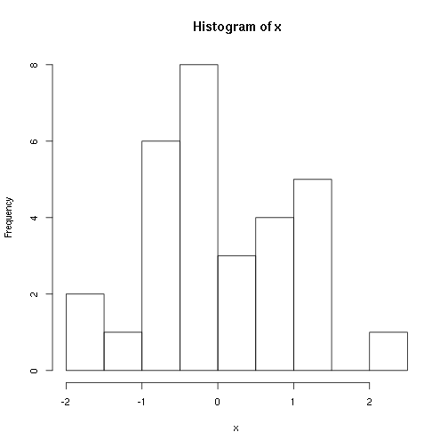

# Um documento em Markdown

## Sobre o Markdown

O Markdown é uma linguagem de marcação muito simples, desenvolvida por
John Gruber.

A ideia básica por trás da linguagem é fazer com que o escritor se
preocupe mais com o **conteúdo** do texto do que com a *formatação*.

## Mais um título

Aqui vamos tentar descrever uma análise.

## Simulando variáveis aleatórias

No R podemos simular valores de uma distribuição normal padrão através
da função `rnorm()`.

Seja $X \sim \text{N}(0,1)$, então para gerar 30 valores dessa variável
aleatório normal, fazemos


```r
(x <- rnorm(30))
```

```
##  [1] -0.23601612 -1.22111178 -1.87483849 -1.65623004  0.74366373
##  [6] -0.61591616 -0.54008593 -0.71838892 -0.33838382  1.03846666
## [11]  0.45033356  1.35437832  1.32015969 -0.03622542 -0.69614982
## [16]  0.10868231 -0.26931664  0.93624985  1.08517727 -0.14182084
## [21]  1.17997189 -0.98863936 -0.24484649  0.39803718  0.54572922
## [26] -0.05349585 -0.02294611  0.52479940  2.09833095 -0.77079163
```

## Comentários

Com o resultado dessa simulação, podemos calcular a média e a variância
dessa VA $X$ para conferir se o resultado fica próximo de 0 e 1,
respectivamente.

## Visualização

Também podemos fazer um histograma dessa VA $X$ simulada


```r
hist(x)
```

 

