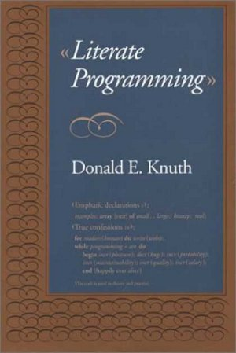
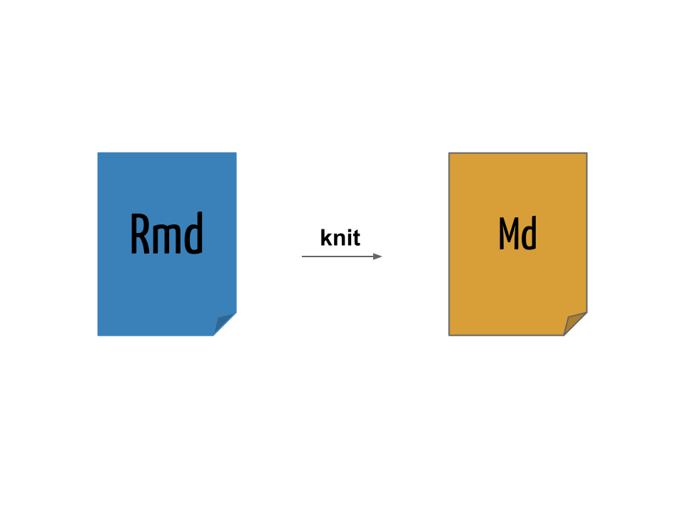
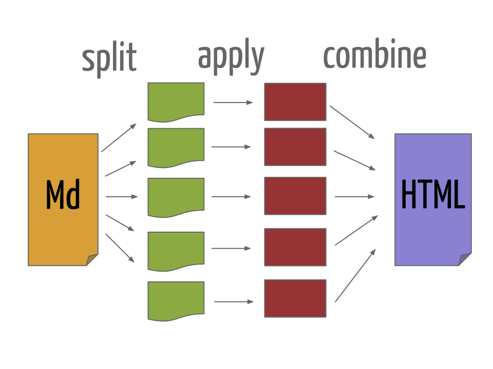

---
output:
  knitrBootstrap::bootstrap_document:
    title: "Documentos com R Markdown"
    theme: Spacelab
    highlight: Zenburn
    theme.chooser: TRUE
    highlight.chooser: TRUE
    menu: FALSE
---

<center>
<h1>
R Markdown
</h1>
<h3>
São Paulo R Users Group
</h3>
<h3>
IME/USP, 18 de setembro de 2015
</h3>
<h6>
<a href="http://www.meetup.com/pt/useR-SP/">http://www.meetup.com/pt/useR-SP/</a>
</h6>
</center>
<br><br>
<p style="display: flex; justify-content: space-between; line-height: 0.75;">
<span>
<a href="http://www.leg.ufpr.br/~fernandomayer">Fernando de Pol Mayer</a>
</span>
<span>
<a href="http://www.ufpr.br/portalufpr/">Universidade Federal do
Paraná</a>
</span>
<p style="display: flex; justify-content: space-between; line-height: 0.75;">
<!-- <span> -->
<!-- <a href="http://www.coordest.ufpr.br/">Curso de Graduação em Estatística</a> -->
<!-- </span> -->
<span>
<a href="http://www.leg.ufpr.br">Lab. de Estatística e Geoinformação - LEG</a>
</span>
<!-- <span> -->
<!-- <p align="right", style="line-height: 0.75;"> -->
<!-- </span> -->
<a href="http://www.est.ufpr.br">Departamento de Estatística</a>
</p>


```{r setup, include=FALSE}
opts_chunk$set(comment = NA,
               bootstrap.panel = TRUE)
```

## Outline

* Mostrar a ideia por trás do uso do R Markdown
* Mostrar possibilidades
* Material disponível:
    - Apresentação: <http://www.leg.ufpr.br/~fernandomayer/useR/Rmarkdown-rautu.html>
    - Código fonte: <http://git.leg.ufpr.br/fernandomayer/Rmarkdown-rautu>

## Como a ciência funciona

* Replicação
	- Muitas vezes difícil
* Reproducibilidade
	- Mais fácil. O mínimo de qualquer pesquisa é ser reprodutível 
* Elementos da reproducibilidade:
	1. Dados
	2. Código
	3. Documentação
	4. Distribuição

## Pesquisa reprodutível

> *The source code is real*
>
> > ESS Project

Pseudo-código para escrever um artigo ou relatório científico:

```{r, bootstrap.show.code = FALSE, results="asis", eval=FALSE}
1. Importe uma base de dados para um *software*
2. Execute um procedimento analítico
3. Gere tabelas e figuras separadamente
4. Copie os resultados de análises
5. Coloque tudo isso em um editor de texto e escreva o documento
```

Mudou alguma linha na base de dados? Esqueceu de algo? Volte para o item
(1) e repita o processo (e boa sorte)!

Pseudo-código para escrever um artigo ou relatório científico
**reprodutível**:

```{r, bootstrap.show.code = FALSE, results="asis", eval=FALSE}
1. Use o R Markdown e realize os 5 passos acima em um único documento
```

Mudou alguma linha na base de dados? Esqueceu de algo? Altere o código e
gere um novo documento.

* Dessa forma, um documento pode ser gerado dinamicamente a partir de um
  **código-fonte**.
* Da mesma forma que um *software* possui seu código-fonte, um documento
  dinâmico é o código-fonte de um relatório.
* É uma combinação de código de computador e as correspondentes
  narrativas descrevendo o resultado que o código está gerando (números,
  tabelas, figuras, ...).
* Quando **compilamos** o documento dinâmico, o código de computador é
  executado, e as saídas são apresentadas. Portanto obtemos um documento
  final que mistura **código** e **texto**.
* Como gerenciamos apenas o código-fonte do documento, ficamos livres de
  todas as etapas manuais mencionadas acima.

## Literate Programming

> *Instead of imagining that our main task is to instruct a computer what
> to do, let us concentrate rather on explaining to humans what we want
> the computer to do.*
>
> > Donald Knuth

O ideia básica por trás de documentos dinâmicos decorre diretamente do
conceito de *literate programming* ("programação letrada"), um paradigma
concebido por [Donald Knuth][] em 1984.

<table>
<tr>
<td align="center"></td>
<td align="center"></td>
</tr>
</table>

* O conceito é o de misturar **literatura** (o texto em uma
  linguagem humana) com **códigos de programação**, tornando claro cada
  etapa de um programa e/ou análise
* Com um único código-fonte, podemos
	- Produzir documentos para humanos (HTML, PDF, ...) &rArr; *weave*
	- Produzir documentos para máquinas (código) &rArr; *tangle*
* Knuth criou um sistema chamado **WEB** para fazer essa mistura
  dos seus textos em $TeX$ com a linguagem Pascal 
* Atualmente muitos outros sistemas existem para misturar códigos
  com texto em várias linguagens

## Literate Programming no R

Com a ascensão do R no início dos anos 2000, [Friedrich Leisch][] criou
o [Sweave][] em 2002

* S + weave
* Permite "entrelaçar" textos do $LaTeX$ com códigos do R
* Ainda é muito utilizado e já é distribuído como uma função do R
  dentro do pacote `utils`

No final de 2011, [Yihui Xie][] criou o pacote [knitr][] com
a proposta de ser mais flexível, fácil e **preparado para a Web**

> *knitr = Sweave + cacheSweave + pgfSweave + weaver +
>     animation::saveLatex + R2HTML::RweaveHTML +
>    highlight::HighlightWeaveLatex + 0.2 * brew + 0.1 *
>    SweaveListingUtils + more*

* knit + R
* Uma re-implementação mais moderna do Sweave
* Permite "entrelaçar" textos do $LaTeX$, HTML e **Markdown** com
  códigos do R
* Também permite misturar texto com códigos de outras linguagens:
  Python, awk, C++, shell.
* Adiciona muitas facilidades como
	- Cache
	- Decoração e formatação automática de códigos
	- Geração de gráficos mais direta

## O que é Markdown?

> *Markdown is a text-to-HTML conversion tool for web writers. Markdown
> allows you to write using an easy-to-read, easy-to-write plain text
> format, then convert it to structurally valid XHTML (or HTML).*
>
> > John Gruber

* [Markdown][] é uma [linguagem de marcação] simples para escrever
  textos
* O texto pode ser lido sem nenhum processamento, ou seja, da maneira
  como está escrito
* Outras linguagens de marcação como HTML e $LaTeX$ requerem um grande
  número de *tags* para formatar o texto, muitas vezes dificultando a
  leitura do código-fonte
* A proposta do Markdown é que o escritor se concentre no texto e não na
  formatação
* Pode ser convertido para vários outros formatos além de HTML

### Sintaxe do Markdown

A sintaxe do Markdown é muito simples, e pode ser resumida da seguinte
forma:

#### Cabeçalhos

```
# Título
## Sub-título
### Sub-sub-título
```

#### Itálico

```
*Este texto aparecerá em itálico.*
```

*Este texto aparecerá em itálico.*

#### Negrito

```
**Este texto aparecerá em negrito.**
```

**Este texto aparecerá em negrito.**

#### Listas não-ordenadas

```
- Primeiro item
- Segundo item
- Terceiro item
```

- Primeiro item
- Segundo item
- Terceiro item

#### Listas ordenadas

```
1. Primeiro item
2. Segundo item
3. Terceiro item
```

1. Primeiro item
2. Segundo item
3. Terceiro item

#### Sub-listas

Utilize 4 espaços para criar uma sub-lista:

```
1. Primeiro item
	- Um sub-item
    - Outro sub-item
2. Segundo item
3. Terceiro item
```

1. Primeiro item
    - Um sub-item
    - Outro sub-item
2. Segundo item
3. Terceiro item

#### Links

Links para endereços Web podem ser inseridos com `[texto](link)`:

```
O criador do conceito de "literate programming" foi
[Donald Knuth](https://en.wikipedia.org/wiki/Donald_Knuth).
```

O criador do conceito de "literate programming" foi
[Donald Knuth](https://en.wikipedia.org/wiki/Donald_Knuth).

```
Devemos instalar o pacote [knitr](http://yihui.name/knitr) para poder
usar o R Markdown.
```

Devemos instalar o pacote [knitr](http://yihui.name/knitr) para poder
usar o R Markdown.

#### Imagens

Para inserir uma imagem, a sintaxe é a mesma de inserir um link, mas com
uma exclamação (`!`) na frente: ``.

O link para a imagem pode ser um enderço Web:

```

```


Ou um endereço local:

```

```


#### Parágrafo

Para criar parágrafos basta pular uma linha:

```
O criador do conceito de "literate programming" foi
[Donald Knuth](https://en.wikipedia.org/wiki/Donald_Knuth).

Devemos instalar o pacote [knitr](http://yihui.name/knitr) para poder
usar o R Markdown.
```

O criador do conceito de "literate programming" foi
[Donald Knuth](https://en.wikipedia.org/wiki/Donald_Knuth).

Devemos instalar o pacote [knitr](http://yihui.name/knitr) para poder
usar o R Markdown.

#### Códigos

Para apresentar códigos na própria linha, colocamos o texto entre duas
crases (` ` `):

```
Para gerar números aleatórios de uma distribuição normal no R, use a
função `rnorm()`.
```

Para gerar números aleatórios de uma distribuição normal no R, use a
função `rnorm()`.

Para apresentar blocos de código, coloque o texto entre três crases
seguidas (` ``` `) no início e no final:

    ```
	x <- rnorm(n = 10, mean = 100, sd = 5)
	hist(x, main = "")
    ```

```
x <- rnorm(n = 10, mean = 100, sd = 5)
hist(x, main = "")
```

Note que esse código não será interpretado, ele apenas será mostrado no
texto. Esse será o papel do R aqui!

#### Tabelas

Tabelas podem ser escritas da seguinte forma:

```
    Caracter | Permissão
    ---------|----------
    `r`      | Permissão de leitura (*read*)
    `w`      | Permissão de escrita (*write*)
    `x`      | Permissão de execução (*execute*)
    `-`      | Permissão desabilitada
```

Para gerar o seguinte resultado:

Caracter | Permissão
---------|----------
`r`      | Permissão de leitura (*read*)
`w`      | Permissão de escrita (*write*)
`x`      | Permissão de execução (*execute*)
`-`      | Permissão desabilitada

#### Equações matemáticas

Equações matemáticas podem ser escritas em formato $LaTeX$. A página
HTML resultante irá remderizar as equações através do [MathJax][].

Equações na própria linha podem ser inseridas entre `$`:

```
Um modelo de regressão linear simples:  $Y = \beta_0 + \beta_1 x + \epsilon$.
```

Um modelo de regressão linear simples: $Y = \beta_0 + \beta_1 x +
\epsilon$.

Equações podem ser exibidas entre `$$`:

```
$$
f(x;\mu,\sigma^2) = \frac{1}{\sigma\sqrt{2\pi}} 
e^{ -\frac{1}{2}\left(\frac{x-\mu}{\sigma}\right)^2 }
$$
```

$$
f(x;\mu,\sigma^2) = \frac{1}{\sigma\sqrt{2\pi}} 
e^{ -\frac{1}{2}\left(\frac{x-\mu}{\sigma}\right)^2 }
$$

### Escrevendo um documento em Markdown

Um documento Markdown possui a extensão `.md` (embora não seja a única
possível).

Veja o arquivo de exemplo [Exemplo1.md](Exemplo1.md).

Para converter um documento Markdown em HTML é necessário um
**conversor**.

O conversor padrão do Markdown é escrito em Perl, e pode ser integrado
em diversas ferramentas, mas não é apropriado para usuários comuns.

Para testar a conversão do documento, copie e cole na página do
[Dingus][].

## Pandoc

O [Pandoc][] é um conversor extremamente versátil, capaz de converter
diversos formatos, incluindo Markdown para HTML.

Se o Pandoc estiver instalado no seu sistema (Linux) é possível
converter o documento com

```{sh, eval=FALSE}
pandoc -f markdown -t html Exemplo1.md -o Exemplo1.html
```

O pacote `knitr` possui a função `pandoc()` que é um *wrapper* para
executar o programa `pandoc` no sistema.

```{r, eval=FALSE}
pandoc(input = "Exemplo1.md", format = "html")
```

Em ambos os casos, o resultado pode ser visualizado ao abrir o arquivo
[Exemplo1.html](Exemplo1.html) no navegador.

## Usando o knitr com Markdown

No exemplo anterior, escrevemos um documento em Markdown (`.md`) e
inserimos códigos do R, que são apenas apresentados no documento final.

Agora vamos usar o knitr a nosso favor, fazedo com que ele interprete e
retorne resultados dos códigos que inserimos.

Para isso renomeie a extensão do arquivo de `.md` para `.Rmd`.

Os blocos de códigos (ou *chunks*) agora devem conter uma marcação
especial para indicar que devem ser interpretados pelo R. Para isso,
colocamos `{r}` no início de cada bloco, que agora ficam

    ```{r}`r ''`
    x <- rnorm(n = 10, mean = 100, sd = 5)
    hist(x, main = "")
    ```

Usando o mesmo exemplo anterior, vamos renomear o arquivo `Exemplo1.md`
para `Exemplo1-knitr.Rmd` e incluir a marção `{r}`.

Também é possível colocar códigos do R para serem renderizados na
própria linha com `` `r '\x60r \x60'` ``, por exemplo, `` `r '\x60r
2+2\x60'` `` gera o resultado `r 2+2` no documento.

Veja o arquivo [Exemplo1-knitr.Rmd](Exemplo1-knitr.Rmd). Agora usamos o
knitr, através da função `knit()` para compilar o documento `.Rmd` em um
documento com sintaxe Markdown `.md`

```{r, eval=FALSE}
knit("Exemplo1-knitr.Rmd")
```
<table>
<tr>
<td align="center"></td>
</tr>
</table>

O resultado da compilação pode ser vista no arquivo
[Exemplo1-knitr.md](Exemplo1-knitr.md). 

Agora temos um documento em Markdown com os códigos do R avaliados. Mas
ainda precisamos processar esse arquivo para gerar o arquivo `.html`
através do Pandoc

```{r, eval=FALSE}
pandoc(input = "Exemplo1-knitr.md", format = "html")
```

que gera o arquivo [Exemplo1-knitr.html](Exemplo1-knitr.html) que poder
ser visualizado no navegador.

## Usando o R Markdown

Para facilitar a conversão de arquivos `.Rmd` em `.html`, usamos o
pacote [rmarkdown][], através da função `render()`.

A função `render()` é uma *wrapper* que internamente chama a
`knitr::knit()` e posteriormente converte o documento para `.html`
usando o Pandoc.

A vantagem de usar a `rmarkdown::render()` é que ela possui uma série de
opções que facilitam a conversão de documentos além de já renderizar
páginas HTML mais amigáveis (atrvés de arquivos CSS).

Para usar esse função você precisa:

1. Instalar o pacote `rmarkdown` com `install.packages("rmarkdown")`
2. Instalar o Pandoc no seu sistema

No RStudio, esse pacote já vem instalado, assim como uma versão embutida
do Pandoc.

Usando o exemplo anterior, vamos compilar o arquivo
[Exemplo1-knitr.Rmd](Exemplo1-knitr.Rmd) com

```{r, eval=FALSE}
## Carrega o pacote
library(rmarkdown)
render("Exemplo1-knitr.Rmd")
```

<table>
<tr>
<td align="center"></td>
</tr>
</table>

E o resultado pode ser visto no arquivo
[Exemplo1-knitr.html](Exemplo1-knitr.html).

No RStudio, esse processo todo pode ser feito pelo botão
<kbd>Knit<kbd>.

## Convertendo R Markdown para outros formatos

Por padrão, a função `render()` gera um arquivo `.html` mas existem
outros formatos finais possíveis graças ao **Pandoc**.

A chamada anterior é equivalente a 

```{r, eval=FALSE}
render("Exemplo1-knitr.Rmd", output_format = "html_document")
```

O pacote `rmarkdown` possui uma sério de formatos de saída, que posuem
os sufixos `_document` para documentos, e `_presentation` para
apresentações (slides). Alguns deles:

* Documentos:
    - `html_document`
    - `pdf_document`
    - `word_document`
* Apresentações:
    - `ioslides_presentation`
    - `slidy_presentation`
    - `beamer_presentation`

Podemos converter um documento em R Markdown para PDF com

```{r, eval=FALSE}
render("Exemplo1-knitr.Rmd", output_format = "pdf_document")

```

O resultado é o arquivo [Exemplo1-knitr.pdf](Exemplo1-knitr.pdf). A
função `render()` usa o Pandoc para converter Markdown para $LaTeX$, e
depois para PDF.

Um documento do Word pode ser gerado com

```{r eval=FALSE}
render("Exemplo1-knitr.Rmd", output_format = "word_document")
```

Para gerar [Exemplo1-knitr.docx](Exemplo1-knitr.docx).

Apresentações em slides HTML podem ser geradas em diversos formatos, um
deles é o `ioslides`

```{r, eval=FALSE}
render("Exemplo1-knitr.Rmd", output_format = "ioslides_presentation",
       output_file = "Exemplo1-knitr-ioslides.html")
```

Veja o resultado em
[Exemplo1-knitr-ioslides.html](Exemplo1-knitr-ioslides.html). 

Apresentações em beamer

```{r, eval=FALSE}
render("Exemplo1-knitr.Rmd", output_format = "beamer_presentation",
       output_file = "Exemplo1-knitr-beamer.pdf")
```

Com resultado no arquivo
[Exemplo1-knitr-beamer.pdf](Exemplo1-knitr-beamer.pdf).

## Metadados

Uma opção interessante ao utilizar o Pandoc é incluir metados no formato
[YAML][].

Os metadados em YAML são escritos em formato de lista aninhada, e o
Pandoc usa essas informações para incluir, por exemplo, título, autor, e
data em um documento.

A opção mais importante para o `rmarkdown` é o campo `output`, que
permite especificar o formato desejado de saída, o mesmo especificado no
argumento `output_format =` da função `render()`.

Os metadados em YAML são colocados sempre no **início** de um documento,
e são delimitados por `---`. Exemplo típico:

```
---
title: "Meu documento em R Markdown"
author: "Fernando Mayer"
date: 18 de setembro, 2015
output: html_document
---
```

Veja o arquivo [Exemplo1-yaml.Rmd](Exemplo1-yaml.Rmd).

Com isso, não é mais necessário especificar o argumento `output_format
=` na chamada da função `render()`.

Também é possível incluir vários formatos ao mesmo tempo, por exemplo

```
---
title: "Meu documento em R Markdown"
author: "Fernando Mayer"
date: 18 de setembro, 2015
output:
  html_document: default
  pdf_document: default
---
```

E compilar todos eles ao mesmo tempo com

```{r, eval=FALSE}
render("Exemplo1-yaml.Rmd", output_format = "all")
```

Veja [Exemplo1-yaml.html](Exemplo1-yaml.html), e
[Exemplo1-yaml.pdf](Exemplo1-yaml.pdf).

## Opções do knitr

Todas as opções do knitr para controlar a saída dos resultados de
códigos do R são válidas para o R Markdown.

* Para afetar um único *chunk*, coloque as opções individualmente
<pre><code>```{r, opt1=val1, opt2=val2}
# código
```</code></pre>
* Para afetar **todos** os *chunks* de um documento, use a função
`knitr::opts_chunk$set()`:
<pre><code>```{r, echo=FALSE}
knitr::opts_chunk$set(opt1 = val1,
                      opt2 = val2
)
```</code></pre>

As opções mais importantes são

* `eval = FALSE` para não avaliar o código, apenas mostrar
* `echo = FALSE` para não mostrar o código, apenas as saídas
* `results = "hide"` para não mostrar as saídas
* `results = "asis"` para que o resultado seja tratado como texto
  literal em Markdown. Por exemplo, para gerar uma tabela a partir de um
  objeto do R, podemos usar a função `knitr::kable()`
<pre><code>```{r, results="asis"}
kable(head(iris))
```</code></pre>

```{r, results="asis", echo=FALSE}
kable(head(iris))
```
* `warning = FALSE` e `message = FALSE` para suprimir as mensagens de
  aviso
* `fig.width = 5` and `fig.height = 5` para alterar o tamanho dos
  gráficos gerados pelo R (em polegadas)
* `cache = TRUE` para armazenar os resultados 

A lista completa de opções está em <http://yihui.name/knitr/options>.

## Um exemplo mais interessante

Para um exemplo mais completo veja o arquivo
[Exemplo2.Rmd](Exemplo2.Rmd).

Note que nos metadados YAML temos mais opções para cada formato de
saída. Para compilar esse documento, podemos usar

```{r, eval=FALSE}
render("Exemplo2.Rmd", output_format = "all")
```

Para gerar os arquivos [Exemplo2.html](Exemplo2.html) e
[Exemplo2.pdf](Exemplo2.pdf).

## Referências


* [knitr in a nutshell](http://kbroman.org/knitr_knutshell)
* [Dynamic Documents with R and knitr](http://www.amazon.com/dp/1498716962/ref=cm_sw_su_dp)
* [Report Writing for Data Science in R](https://leanpub.com/reportwriting)
* 


<!-- links -->

[Donald Knuth]: https://en.wikipedia.org/wiki/Donald_Knuth
[MathJax]: http://www.mathjax.org
[Dingus]: http://daringfireball.net/projects/markdown/dingus
